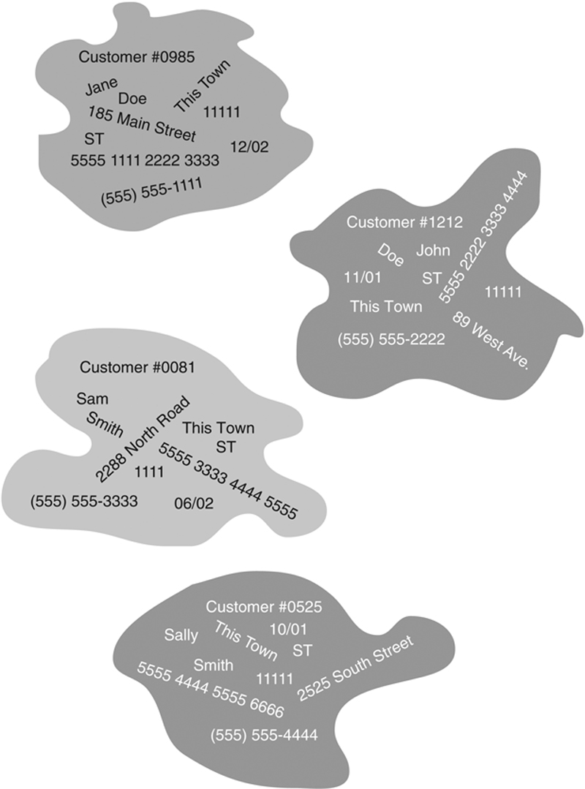
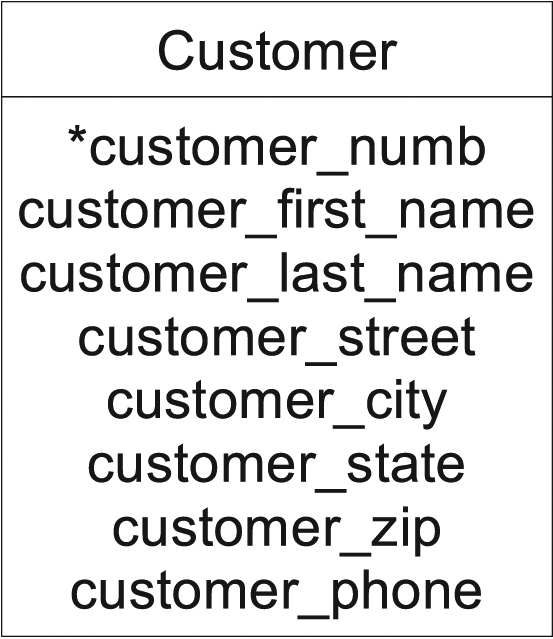
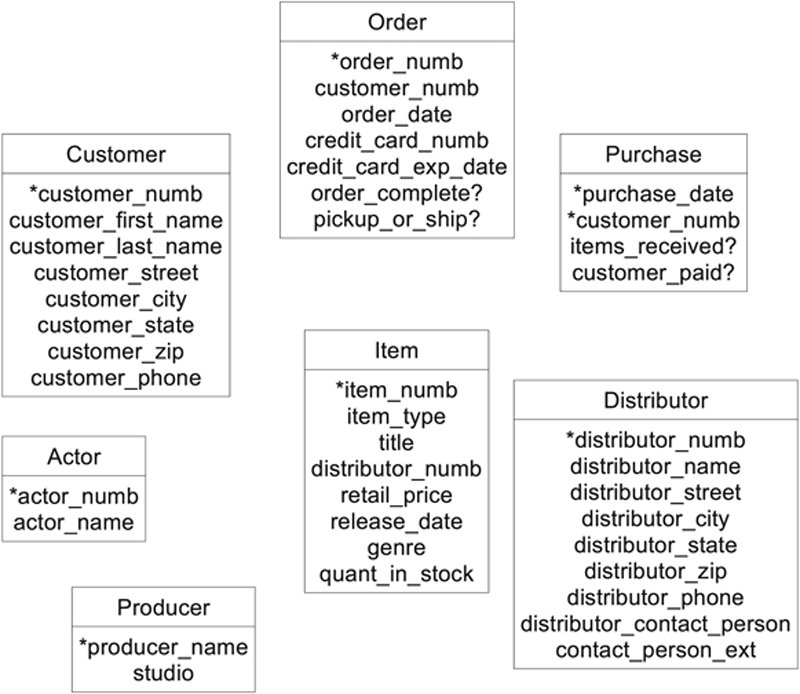

# DATABASES

## Bases de datos Relacionales

### Definición 

Un lugar donde se almacena información de forma organizada

### Tipos 

* Bases de datos operativas
* Bases de datos analiticas

### Bases de datos operativas 

* Estás bases de datos se utilizan principalmente en OLTP(procesamiento de transacciones en linea), es decir, en situaciones donde existe la necesidad de recopilar, modificar y mantener datos diariamente.
* El tipo de datos almacenados en una base de datos operativa es dinámico

### Bases de datos analiticas 

* Se utilizan principalmente en OLAP(procesamiento analítico y en linea) donde existe la necesidad de almacenar y rastrear datos históricos y dependientes del tiempo.
* El tipo de datos almacenados en una base de datos analitica es estático

### Base de datos Relacionales 

Almacena datos en tablasEl modelo relacional clasifica las relaciones como uno a uno, uno a muchos, y muchos a muchos.

### Entidades y sus atributos 

Una entidad es algo sobre lo que almacenamos información, y los atributos son las datos que describen a esta entidadesPor ejemplo, una entidad del cliente generalmente se describe con un número de cliente, nombre, apellido, calle, ciudad, estado, código postal y número de teléfono.

### Instancias de una entidad cliente en una base de datos. 

## Entidades y sus atributos 

Una _<mark style="color:purple;">**ENTIDAD**</mark>_ es algo sobre lo que almacenamos datos. Un cliente es una entidad. Las entidades no son necesariamente tangibles. Por ejemplo, un evento como un concierto es una entidad; Una cita para ver a un médico es una entidad. Las entidades tienen datos que las describen ( sus _<mark style="color:purple;">**ATRIBUTOS**</mark>_). Por ejemplo, una entidad del cliente generalmente se describe con un número de cliente, nombre, apellido, calle, ciudad, estado, código postal y número de teléfono. Una entidad de concierto puede ser descrita por un título, fecha, ubicación y nombre del intérprete.

<figure><figcaption>
Instancias de una entidad cliente en una base de datos.
</figcaption></figure>

### Identificadores de entidad 

El único propósito para poner los datos que describen una entidad en una base de datos ( una instancia de la entidad ) es recuperar los datos en una fecha posterior. esta significa que debemos tener alguna forma de distinguir una instancia de entidad de otra, para que siempre podamos estar seguros de que estamos recuperando la instancia precisa que queremos. Hacemos esto asegurando que cada instancia de entidad tenga algunos valores de atributo que lo distingan de cualquier otra instancia de la misma entidad en la base de datos ( un identificador de entidad).

### Atributos multivalor de valor único

Debido a que eventualmente vamos a crear una base de datos relacional, los atributos en nuestro modelo de datos deben ser de un solo valor. Esto significa que para una instancia dada de una entidad, cada atributo puede tener solo un valor. Si un cliente tiene más de un número de teléfono y lo quiere todo incluido en la base de datos, entonces la entidad del cliente no puede manejarlos.

_**¿Cuál es el problema con los atributos multivalorados? Los atributos multivalorados pueden causar problemas con el significado de los datos en la base de datos, ralentizar significativamente la búsqueda y establecer restricciones innecesarias sobre la cantidad de datos que se pueden almacenar.**_

~~<mark style="color:red;">**Al buscar un atributo multivalor, un DBMS debe buscar cada valor en el atributo, probablemente escaneando el contenido del atributo secuencialmente. Una búsqueda secuencial es el tipo de búsqueda más lento disponible.**</mark>~~

Como regla general, si se encuentra con un atributo multivalor, esta es una pista importante de que necesita otra entidad. <mark style="color:green;">La única forma de manejar múltiples valores del mismo atributo es crear una entidad de la cual pueda almacenar múltiples instancias</mark>, una para cada valor del atributo

### Evitar colecciones de entidades 

Cuando comienza a trabajar con entidades, la naturaleza de una entidad puede ser algo confusa. Considere, por ejemplo, el inventario de mercancías manejado por Ópticos antiguos. ¿Es “ inventory ” una entidad? No. Inventario es una colección de los artículos de mercancías manejados por la tienda. La entidad es en realidad el artículo de la mercancía. Ver todas las instancias de la entidad del artículo de mercancía en su conjunto proporciona el inventario.

### Entidades documentales y sus atributos&#x20;

Diagramas de relación de entidad ( ER ) ( ERDs ) proporcionar una forma de documentar las entidades en una base de datos, junto con los atributos que las describen. Hoy hay tres grandes métodos: el modelo Chen ( llamado así por el creador del modelado ER, Dr. Peter P.S. Chen ), Ingeniería de la información ( IE, o “ patas de gallo ” ), y Lenguaje de modelado unificado ( UML ).

Los estilos IE y UML de diagramación ER incluyen los atributos en el rectángulo con la entidad; el identificador de entidad está precedido por un asterisco ( \* ):

<figure><figcaption></figcaption></figure>

<figure><figcaption></figcaption></figure>

### Dominios

Cada atributo tiene un dominio, una expresión de los valores permitidos para ese atributo. Un dominio puede ser muy pequeño. Por ejemplo, una tienda de camisetas puede tener un atributo de Tamaño para sus artículos de mercancía, con los valores L, XL y XXL que comprenden todo el dominio. En contraste, un atributo para el nombre de un cliente es muy grande y puede especificarse solo como “ texto ” o “ nombres humanos. ”

Un DBMS hace cumplir un dominio a través de un restricción de dominio.

### Relaciones basicas entre datos

Hay tres tipos básicos de relaciones que puede encontrar: uno a uno ( 1: 1 ), uno a muchos ( 1: M ) y muchos a muchos ( M : N o M: M ).

#### Relaciones uno a uno (1:1)

Considere, por un momento, un aeropuerto en una pequeña ciudad y la ciudad en la que se encuentra el aeropuerto, los cuales se describen en una base de datos de aeropuertos de pequeñas ciudades. Cada uno de estos podría estar representado por una instancia de un tipo diferente de entidad. La relación entre las dos instancias se puede expresar como “ El aeropuerto está ubicado en una sola ciudad, y la ciudad tiene un solo aeropuerto.

Las verdaderas relaciones uno a uno son muy raras en los negocios. Por ejemplo, suponga que Ópticos antiguos decide comenzar a tratar con un nuevo distribuidor de DVD. Al principio, la compañía solo ordena un título especializado del nuevo distribuidor. Si miramos dentro de la base de datos, veríamos que la instancia de la entidad distribuidora estaba relacionada solo con la única instancia de artículos de mercancía. Esto parecería ser una relación uno a uno. Sin embargo, con el tiempo, Ópticos antiguos puede optar por pedir más títulos al nuevo distribuidor, lo que violaría la regla de que el distribuidor debe estar relacionado con no más de un artículo de mercancía.

#### Relaciones uno a muchos 

El tipo de relación más común es una relación uno a muchos. ( De hecho, las bases de datos relacionales se construyen a partir de la rara relación uno a uno y numerosas relaciones uno a muchos. )

Si tenemos instancias de dos entidades ( A y B ), entonces existe una relación de uno a muchos entre dos instancias ( Ayo y Byo) si Ayo está relacionado con cero, uno o más casos de entidad B y Byo está relacionado con cero o una instancia de la entidad A. Otras relaciones entre uno incluyen la que existe entre una hija y su madre biológica. Una mujer puede tener cero, una o más hijas biológicas; una hija puede tener solo una madre biológica.

#### Relacion de muchos a muchos

### ​ 

### ​ 

### identificadores de identidad 

Estos nos garantiza que una instancia tiene un identificador único
