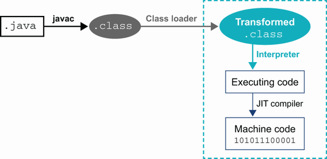
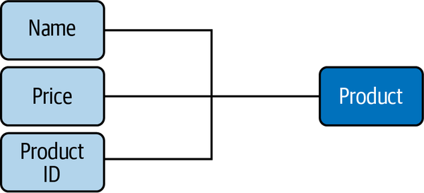
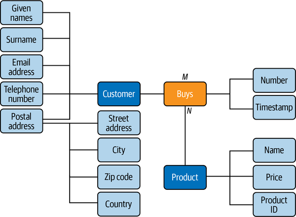
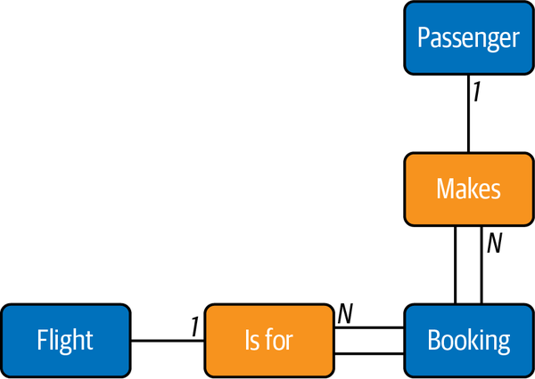
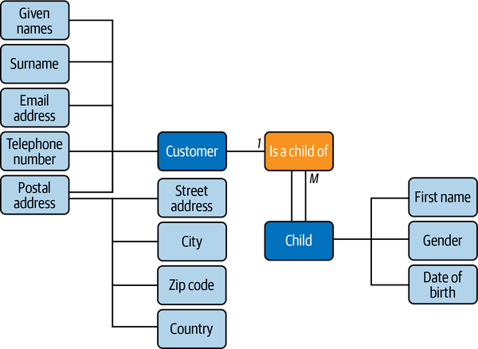

# MySQL

## El proceso de diseño de la base de datos

#### Análisis de requisitos

Primero, determinamos y escribimos lo que necesitamos de la base de datos, qué datos almacenaremos y cómo se relacionan los elementos de datos entre sí.

#### Diseño conceptual

Una vez que conocemos los requisitos de la base de datos, los destilamos en una descripción formal del diseño de la base de datos.

#### Diseño lógico

Finalmente, mapeamos el diseño de la base de datos en un sistema de gestión de bases de datos existente y tablas de bases de datos.

### Cardinalidad

**Ejemplos**

Una persona puede tener varias tarjetas de crédito, pero cada tarjeta de crédito pertenece a una sola persona. Mirándolo de otra manera, un _uno a muchos_ la relación se convierte en un _muchos a uno_ relación; por ejemplo, muchas tarjetas de crédito pertenecen a una sola persona.

<figure><figcaption></figcaption></figure>

### Modelo Entidad Relación(ER)

### Entidad

Normalmente, usamos la base de datos para almacenar características específicas, o _atributos_, de las entidades. Podríamos registrar el nombre, la dirección de correo electrónico, la dirección postal y el número de teléfono de cada cliente en una base de datos de ventas.&#x20;

<figure><figcaption></figcaption></figure>

<figure><figcaption></figcaption></figure>

### Relación

Las entidades pueden participar en relaciones con otras entidades.Por ejemplo, un cliente puede comprar un producto, un estudiante puede tomar un curso, un empleado puede tener una dirección, etc.

Como entidades, las relaciones pueden tener atributos: podemos definir que una venta sea una relación entre una entidad cliente ( identificada por la dirección de correo electrónico única ) y un número dado de la entidad del producto ( identificada por el ID de producto único ) que existe en una fecha y hora en particular ( la marca de tiempo ).

<figure><figcaption></figcaption></figure>

### [https://learning.oreilly.com/library/view/learning-mysql-2nd/9781492085911/ch02.html#idm45323489646712](https://learning.oreilly.com/library/view/learning-mysql-2nd/9781492085911/ch02.html#idm45323489646712)

### Entidades intermedias

A menudo es posible simplificar conceptualmente una relación de muchos a muchos reemplazándola por una nueva entidad **intermedia**(a veces llamada entidad _**asociada**_) y conectar las entidades originales a través de una relación de muchos a uno y de uno a muchos.

<figure><figcaption>
Un pasajero participa en una relación M: N con un vuelo.
</figcaption></figure>

Sin embargo, veamos esto desde ambos lados de la relación:

* Cualquier vuelo puede tener muchos pasajeros con una reserva.
* Cualquier pasajero puede tener reservas en muchos vuelos.

Por lo tanto, podemos considerar que la relación de muchos a muchos es, de hecho, dos relaciones de uno a muchos, una en cada sentido. Esto nos señala la existencia de una _**entidad intermedia oculta**_, la reserva, entre las entidades de vuelo y pasajeros.

<figure><figcaption>
La entidad de reserva intermedia entre las entidades de pasajeros y vuelos.
</figcaption></figure>

### Entidad débil

Una entidad débil se identifica de manera única en el contexto de su posesión ( o _fuerte_Entidad ), por lo que la clave completa para una entidad débil es la combinación de su propia clave parcial ( ) con la clave de su entidad propietaria. Para identificar de manera única a un niño en nuestro ejemplo, necesitamos el nombre del niño y la dirección de correo electrónico del padre del niño.

<figure><figcaption></figcaption></figure>

###

## Normalización de la base de datos

### DATOS

Usamos los términos abreviados _1: 1_, _1: N_, y _M: N_ para relaciones uno a uno, uno a muchos y muchos a muchos.
